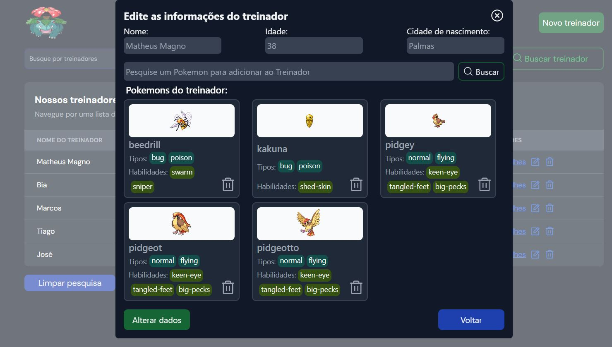

# DT Money (Aplicação para gestão Financeira )

Desafio de React do ignite (Rocketseat)

## Capa

 <br/> <br/>


## Funcionalidades da aplicação

- Criar treinadores 
- Lista de treinadores
- Deletar treinadores
- Pesquisar por treinadores
- Atualizar informações de um treinador
- Listar pokemons
- Adicionar pokemons à um determinada treinador
- Excluir pokemons de um treinador
- Pesquisar por um determinado pokemon


## Tecnologias utilizadas

- React
- Typescript
- Vite
- Context API
- radix-ui
- Tailwind
- React hook form
- Phosphor React
- uuid

## Como executar a aplicação

### Instalação

1. Clone o repositório

```bash
git clone https://github.com/Magon0/Financial-Management
```

2. Acesse a pasta do projeto

```bash
cd Financial-Management
```

3. Instale as dependências necessárias

```bash
npm install
```

4. Execute o projeto Frontend

```bash
npm run dev
```

5. Execute o script para subir json-server

```bash
npm run dev:server
```
